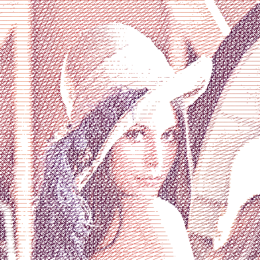

# filters
image and video filters

**mousedraw.py**

Draw a picture manually like the style below by using mousedraw.py. The first time I saw this type of painting was on a magazine very long time ago(about 2005). It was a series portrait of famous people and I can only remeber there was a Bin Ladin in it. I cannot find any thing about it on Internet now. Please tell me if you know anything about that series.

The idea is to calculate the average color in the drawn circle area and paint on the canvas. Draw circles wherever you want without worry about the color.

To calculate the avgcolor, it first fill the area with value 1 on an 1-channel mask which value are all 0. The mask size is same as the source image. Then split the R, G, B channels of src image. For each channel, calculate the Hadamard product with the mask. So, only values in the purposed area of each channel are remained. Finally, the avgcolor of each channel can be get by sum(channel)/sum(mask).

operations: 
drag mouse to draw circle 
w, a, s, d - move the circle by 1 pixel 
'&#91;' / '&#93;' - increase/ decrease radius 
e - clear 
c - fill the circle area 
o - save image 
 

**randomrects.py**

Generate circle or rectangular randomly to cover the image with calculating the average color to fill the area.
More details can be added by using mousedraw.py.
<table>
  <tr>
    <td></td>
    <td></td>
  </tr>
  <tr>
    <td></td>
    <td></td>
  </tr>
</table>

s - save image

**crosshatching.py**

Crosshatching line style filter.

<table>
  <tr>
    <td></td>
    <td></td>
    <td></td>
  </tr>
</table>

**dots.py**

This filter can be present better in video mode with a dynamic dot size. The radius of dot is determined by the value in grayscale. So it can't work well on images with a low contrast or too bright.

 
 

**image information:**

[parrot](https://www.pexels.com/photo/bird-flying-zoo-beak-9291/) from [skitterphoto](https://www.pexels.com/@skitterphoto)

[eagle](https://www.pexels.com/photo/usa-bald-eagle-portrait-close-53581/),
[leopard](https://www.pexels.com/photo/tiger-animal-39857/),
[tiger](https://www.pexels.com/photo/photo-of-a-tiger-roaring-38278/),
[zebra](https://www.pexels.com/photo/africa-animal-black-and-white-black-and-white-259351/) from [pixabay](https://www.pexels.com/@pixabay)

[moon](https://www.pexels.com/photo/full-moon-167762/) from [Sebastian Voortman](https://www.pexels.com/@sebastian)

[tree](https://www.pexels.com/photo/landscape-nature-sky-clouds-81413/) from [tookapic](https://www.pexels.com/@tookapic)

[building](https://www.pexels.com/photo/photography-of-city-buildings-941195/) from [Min An](https://www.pexels.com/@minan1398)
